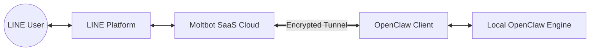

# OpenClaw LINE Connect

<div align="center">


**Connect your local OpenClaw AI to LINE Messenger in seconds.**

[**🌐 Official Website**](https://moltbot4line.nocory.ai/)

[](https://www.python.org/)
[](LICENSE)
[]()
[]()

[English](#-overview) | [中文](#-概述) | [日本語](#-概要)

</div>

---

## 📖 Overview

**OpenClaw LINE Connect** is a lightweight, secure bridge that exposes your local OpenClaw AI instance to the LINE Messaging API. It creates an encrypted tunnel between your machine and the Moltbot SaaS cloud, allowing you to use your personal local LLM as a LINE bot without deploying any servers.

Runs entirely on your machine. Your data stays with you.

### ✨ Features

- **🔌 One-Click Setup**: Zero configuration. Just run and scan the QR code.
- **🔒 Secure Tunneling**: End-to-end encryption via Cloudflare Tunnel. No port forwarding required.
- **🔄 Smart Reconnect**: Auto-healing connection that survives network interruptions.
- **⚡️ Low Latency**: Optimized local proxy for instant AI responses.
- **🛑 Daemon Mode**: Run as a background service for 24/7 availability.

### 🚀 Installation

The easiest way to install is via our one-line installer:

```bash
curl -fsSL https://moltbot4line.nocory.ai/install.sh | bash
```

### 🛠 Usage

#### Connect (Interactive Mode)
Starts the service and displays a QR code for binding. Best for first-time setup.

```bash
moltbot-line connect
```

#### Background Service (Daemon)
Runs the service in the background with auto-reconnection enabled. Best for long-running instances.

```bash
moltbot-line daemon
```

#### Check Status
View current connection status, gateway ID, and bound users.

```bash
moltbot-line status
```

#### View Logs
Tail the real-time logs of the service.

```bash
moltbot-line logs
```

#### Uninstall
Remove the application and configuration.

```bash
moltbot-line uninstall
```

### 🏗 Architecture



1. **LINE Platform** receives a user message.
2. **Moltbot SaaS** routes it to your specific `gateway_id`.
3. **OpenClaw Client** receives the payload via the secure tunnel.
4. **Local OpenClaw** processes the text/image/voice and generates a response.
5. The response travels back through the tunnel to LINE.

---

## 📖 概述

**OpenClaw LINE Connect** 是一個輕量且安全的橋接工具，能將您本地端的 OpenClaw AI 實例與 LINE Messaging API 無縫連接。它會在您的電腦與 Moltbot SaaS 雲端之間建立一條加密隧道，讓您無需自行架設伺服器，即可將個人的 Local LLM 變成專屬的 LINE 機器人。

一切皆在您的機器上運行，數據完全掌握在您手中。

### ✨ 功能特色

- **🔌 一鍵安裝**: 零配置。執行指令並掃描 QR Code 即可開始使用。
- **🔒 安全通道**: 透過 Cloudflare Tunnel 進行端對端加密，無需設定 Port Forwarding。
- **🔄 自動重連**: 具備自動修復機制，能在網路中斷後自動恢復連線。
- **⚡️ 極低延遲**: 針對 AI 應用優化的本地代理，確保即時回應。
- **🛑 背景服務**: 支援 Daemon 模式，可 24/7 全天候在背景運行。

### 🚀 安裝方式

使用我們的一鍵安裝指令即可快速開始：

```bash
curl -fsSL https://moltbot4line.nocory.ai/install.sh | bash
```

### 🛠 使用說明

#### 連線 (互動模式)
啟動服務並顯示綁定用的 QR Code。最適合初次設定使用。

```bash
moltbot-line connect
```

#### 背景服務 (Daemon)
在背景執行服務，並啟用自動重連功能。適合長時間掛機運作。

```bash
moltbot-line daemon
```

#### 檢查狀態
查看目前的連線狀態、Gateway ID 以及已綁定的使用者。

```bash
moltbot-line status
```

#### 查看日誌
即時查看服務的運行日誌。

```bash
moltbot-line logs
```

#### 移除安裝
移除應用程式與所有設定。

```bash
moltbot-line uninstall
```

---

## 📖 概要

**OpenClaw LINE Connect** は、ローカルの OpenClaw AI インスタンスを LINE Messaging API にシームレスに接続する、軽量でセキュアなブリッジツールです。お使いの PC と Moltbot SaaS クラウド間に暗号化されたトンネルを作成し、サーバーを構築することなく、ローカル LLM を自分だけの LINE ボットとして利用できます。

すべてローカルマシン上で動作し、データはあなたの管理下にあります。

### ✨ 主な機能

- **🔌 ワンクリックセットアップ**: 面倒な設定は不要。実行して QR コードをスキャンするだけです。
- **🔒 セキュアトンネル**: Cloudflare Tunnel によるエンドツーエンド暗号化。ポート開放は不要です。
- **🔄 自動再接続**: ネットワークが切断されても自動的に復旧する自己修復機能を搭載。
- **⚡️ 低レイテンシ**: AI レスポンスのために最適化されたローカルプロキシ。
- **🛑 デーモンモード**: 24時間365日の稼働に対応したバックグラウンドサービスモード。

### 🚀 インストール

以下のコマンドを実行するだけでインストールできます：

```bash
curl -fsSL https://moltbot4line.nocory.ai/ | bash
```

### 🛠 使い方

#### 接続 (インタラクティブモード)
サービスを起動し、バインディング用の QR コードを表示します。初回セットアップに最適です。

```bash
moltbot-line connect
```

#### バックグラウンドサービス (デーモン)
自動再接続を有効にしてバックグラウンドでサービスを実行します。常時稼働させる場合に推奨されます。

```bash
moltbot-line daemon
```

#### ステータス確認
現在の接続状態、Gateway ID、バインドされているユーザーを確認します。

```bash
moltbot-line status
```

#### ログ表示
サービスのリアルタイムログを表示します。

```bash
moltbot-line logs
```

#### アンインストール
アプリケーションと設定を削除します。

```bash
moltbot-line uninstall
```

---

## 📄 License

This project is licensed under the **Creative Commons Attribution-NonCommercial 4.0 International License (CC BY-NC 4.0)**. 

- **Attribution**: You must give appropriate credit to [Nocory.ai](https://nocory.ai).
- **Non-Commercial**: You may not use this software for commercial purposes without a license.

For commercial inquiries, please contact [hello@nocory.ai](mailto:hello@nocory.ai).

---

<div align="center">
  <sub>Built with ❤️ by the <a href="https://nocory.ai">Nocory.ai</a></sub>
</div>
